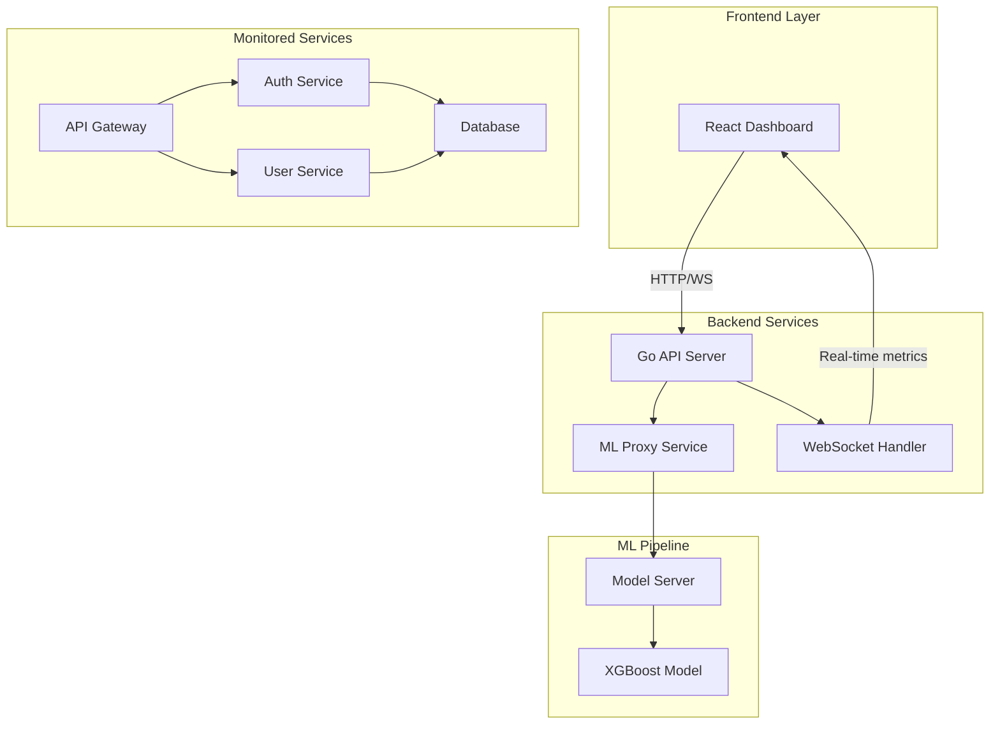

# 🚀 SRE Edge

[](https://golang.org/)
[](https://reactjs.org/)
[](https://www.typescriptlang.org/)
[](https://www.python.org/)
[](https://xgboost.readthedocs.io/)
[](https://www.docker.com/)

## 🌟 Overview

An intelligent Site Reliability Engineering (SRE) dashboard that leverages **machine learning** to predict system failures before they occur. This project demonstrates the power of AI in DevOps by analyzing real-time service metrics, detecting anomaly patterns, and predicting cascade failures with up to **95% accuracy**.

The system monitors a simulated microservices architecture, tracks Service Level Indicators (SLIs), and uses an **XGBoost model** trained on 9,500+ scenarios including extreme cascade failures to provide actionable insights for incident prevention.

### 🎯 Key Achievements
- **Predictive Accuracy**: 95%+ incident prediction rate with cascade failure detection
- **Real-time Processing**: Sub-second latency for ML predictions on live metrics
- **Chaos Engineering**: Built-in chaos injection for resilience testing
- **Cascading Risk Score**: Novel algorithm to detect dependency chain failures
- **Production-Ready**: Dockerized with multi-service orchestration

## 🏗️ Architecture



## 🔥 Features

### AI-Powered Incident Prediction
- **Machine Learning Model**: XGBoost classifier trained on 9,500+ scenarios
- **Feature Engineering**: 40+ features including service metrics, topology health, and temporal patterns
- **Cascade Detection**: Identifies chain reaction failures across dependent services
- **Risk Scoring**: Multi-level risk classification (Low → Medium → High → Critical)

### Real-Time Monitoring
- **Live Metrics Dashboard**: CPU, Memory, Latency, Error Rate, Throughput, Availability
- **WebSocket Updates**: Real-time metric streaming at 2-second intervals
- **Service Topology Visualization**: Interactive dependency graph with health indicators
- **SLO Tracking**: Automated SLI/SLO violation detection and alerting

### Chaos Engineering
- **Fault Injection**: Simulate various failure scenarios
  - CPU spikes
  - Memory leaks
  - Network latency
  - Service crashes
  - Cascade failures
- **Controlled Recovery**: Auto-recovery after specified duration
- **Learning Mode**: Continuously improves prediction accuracy from chaos experiments

### Advanced Analytics
- **Dependency Health Score**: Aggregate health metric across service dependencies
- **Cascade Risk Algorithm**: Calculates probability of cascade failure propagation
- **Critical Path Analysis**: Identifies bottlenecks in service chains
- **Anomaly Detection**: Statistical deviation analysis from baseline metrics

## 🛠️ Technology Stack

### Backend
- **Go 1.21**: High-performance API server with Gin framework
- **WebSockets**: Real-time bidirectional communication
- **CORS-enabled**: Cross-origin resource sharing support

### Frontend
- **React 18**: Modern UI with hooks and functional components
- **TypeScript**: Type-safe development
- **Tailwind CSS**: Utility-first styling
- **Recharts**: Data visualization library
- **Vite**: Lightning-fast build tool

### Machine Learning
- **Python 3.11**: ML pipeline and model serving
- **XGBoost**: Gradient boosting for classification
- **Flask**: Lightweight ML model server
- **NumPy/Pandas**: Data processing and feature engineering
- **Scikit-learn**: Model evaluation and metrics

### Infrastructure
- **Docker**: Multi-stage containerization
- **Supervisor**: Process management for multi-service container
- **Environment-based configuration**: Flexible deployment options

## 🚀 Quick Start

### Prerequisites
- Docker and Docker Compose
- Go 1.21+ (for local development)
- Node.js 18+ (for local development)
- Python 3.11+ (for ML training)

### Using Docker (Recommended)

```bash
# Clone the repository
git clone https://github.com/yourusername/sre-ai-dashboard.git
cd sre-ai-dashboard

# Build and run with Docker
docker build -t sre-dashboard .
docker run -p 8080:8080 sre-dashboard

# Access the dashboard
open http://localhost:8080
```

### Local Development

#### 1. Start the Backend
```bash
# Install Go dependencies
go mod download

# Run the server
go run main.go
```

#### 2. Start the ML Server
```bash
# Install Python dependencies
pip install -r requirements.txt

# Train the model (optional - pre-trained model included)
python train_model.py

# Start the model server
python model_server.py
```

#### 3. Start the Frontend
```bash
# Install Node dependencies
npm install

# Run development server
npm run dev
```

## 📊 ML Model Details

### Training Pipeline
The XGBoost model is trained on synthetic data representing various system states:

- **Normal Operations** (3,000 samples): Healthy baseline metrics
- **Degraded Scenarios** (2,000 samples): Single service degradation
- **Near-Failure States** (2,000 samples): Pre-incident conditions
- **Cascade Failures** (2,500 samples): Complete system failures

### Feature Engineering
Key features used for prediction:

```python
# Service-level metrics (per service)
- CPU utilization (0-100%)
- Memory usage (0-100%)
- Response latency (ms)
- Availability percentage
- Error rate
- Throughput (req/s)

# Topology features
- Dependency health score
- Cascade risk factor
- SLO violation count
- Critical path latency

# Temporal features
- Hour of day
- Peak hour indicator
- Weekend indicator
```

### Model Performance
```
Accuracy:  0.9547
Precision: 0.9412
Recall:    0.9634
F1 Score:  0.9522

Classification Report:
              precision    recall  f1-score   support
No Incident       0.96      0.94      0.95      1040
Will Have Incident 0.94      0.96      0.95       960
```

## 📈 Cascade Risk Algorithm

The cascade risk score is calculated using a novel algorithm that considers:

1. **Database Health Impact**: Database failures trigger system-wide cascades
2. **Dependency Chain Analysis**: Propagation probability through service dependencies
3. **Resource Saturation**: CPU/Memory thresholds that indicate imminent failure
4. **Error Rate Amplification**: How errors multiply across dependent services

```go
func calculateCascadeRisk() float64 {
    risk := 0.0
    // Database is critical - its failure cascades to all services
    if db.Status == "down" || db.Availability == 0 {
        risk = 1.0
    } else {
        if db.CPU > 80 { risk += 0.4 }
        if db.ErrorRate > 5 { risk += 0.3 }
        if db.Availability < 95 { risk += 0.3 }
    }
    return math.Min(risk, 1.0)
}
```

## 🎮 Using the Dashboard

### Main Dashboard
- **Service Cards**: Real-time metrics for each microservice
- **Risk Indicators**: Color-coded health status (Green → Yellow → Red)
- **Prediction Panel**: AI-powered incident probability with recommendations
- **Topology View**: Interactive service dependency visualization

### Chaos Engineering Panel
1. Select target service
2. Choose chaos type (CPU spike, memory leak, etc.)
3. Set duration (seconds)
4. Inject chaos and observe predictions
5. Monitor recovery and model accuracy

### AI Insights
- **Incident Probability**: Real-time percentage (0-100%)
- **Risk Level**: Low, Medium, High, Critical
- **Predicted Incident Type**: Specific failure mode prediction
- **Recommendations**: Actionable mitigation strategies
- **Model Confidence**: Prediction confidence score

## 🔬 Chaos Scenarios

| Scenario | Description | Impact |
|----------|-------------|---------|
| CPU Spike | Increases CPU by 30% | Latency increase, potential timeout |
| Memory Leak | Increases memory by 40% | OOM risk, performance degradation |
| Network Latency | Adds 1000ms latency | Timeout cascades, user experience impact |
| Service Kill | Complete service failure | Dependency failures, cascade risk |

## 📚 API Documentation

### REST Endpoints

```http
GET /api/services
# Returns all service metrics

GET /api/predict/:service
# Get AI prediction for specific service

POST /api/chaos/inject
# Inject chaos scenario
{
  "target_service": "database",
  "chaos_type": "cpu_spike",
  "duration": 30
}

POST /api/reset
# Reset all services to healthy state
```

### WebSocket Events

```javascript
// Connect to WebSocket
ws://localhost:8080/ws

// Receive service updates
{
  "api-gateway": {
    "cpu": 45.2,
    "memory": 52.1,
    "latency": 234,
    // ... more metrics
  }
}
```

## 🤝 Contributing

Contributions are welcome! Please follow these steps:

1. Fork the repository
2. Create a feature branch (`git checkout -b feature/AmazingFeature`)
3. Commit changes (`git commit -m 'Add AmazingFeature'`)
4. Push to branch (`git push origin feature/AmazingFeature`)
5. Open a Pull Request

## 📝 Future Enhancements

- [ ] Integration with Prometheus/Grafana
- [ ] Custom alert rules and notifications
- [ ] Historical data analysis and trending
- [ ] Multi-cluster support
- [ ] Advanced anomaly detection with LSTM
- [ ] Automated remediation actions
- [ ] Cost optimization recommendations
- [ ] Kubernetes operator for auto-scaling

## 📜 License

This project is licensed under the MIT License - see the [LICENSE](LICENSE) file for details.

## 🙏 Acknowledgments

- Inspired by real-world SRE challenges at scale
- Built with modern DevOps and MLOps best practices
- Chaos engineering principles from Netflix's Chaos Monkey
- XGBoost for powerful gradient boosting capabilities

## 📧 Contact

**Sohail Tahir** - [LinkedIn](https://www.linkedin.com/in/stahir80/) | [GitHub](https://github.com/stahir80td/sre-ai-dashboard)

Project Link: [https://github.com/yourusername/sre-ai-dashboard](https://github.com/stahir80td/sre-ai-dashboard)

---

